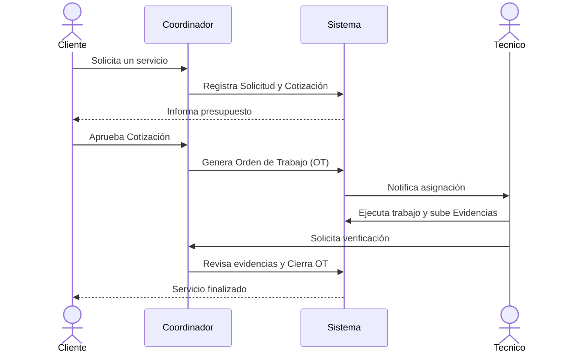

# ServiceFlow Backend

<div align="center">

**Sistema de gestión integral para empresas de servicios generales**


</div>

---

## Descripción

**ServiceFlow** es una API REST backend construida como un **Monolito Modular** con Spring Boot. Está diseñada para digitalizar y automatizar el flujo operativo completo de empresas de servicios generales (5–20 personas): desde la recepción de solicitudes de clientes, pasando por la cotización, hasta la generación y seguimiento de órdenes de trabajo con asignación de técnicos.

Para instrucciones detalladas sobre cómo instalar, ejecutar (Docker/Local) y consumir la API, por favor consulta nuestra **[Guía de Uso y Configuración (GUIA.md)](GUIA.md)**.

---

## Flujo de Negocio (Business Flow)

El núcleo del sistema gestiona la trazabilidad completa de cada servicio a través del siguiente flujo de trabajo:



---

## Características Principales

| Característica | Detalle |
|---|---|
| **Arquitectura Modular** | Diseño *Package by Feature* con 6 módulos independientes |
| **Autenticación JWT** | Stateless, tokens firmados con HMAC-SHA256 |
| **Autorización RBAC** | 3 roles: `ADMIN`, `COORDINADOR`, `TECNICO` |
| **Migraciones Flyway** | Esquema versionado e inmutable (V1–V4) |
| **Manejo Global de Errores** | Respuestas JSON estandarizadas vía `@RestControllerAdvice` |
| **Docker Ready** | Multi-stage build + Docker Compose |

---

## Stack Tecnológico

- **Lenguaje:** Java 21 (`Records` para DTOs inmutables)
- **Framework:** Spring Boot 4.1.1
- **Persistencia:** Spring Data JPA / Hibernate 7
- **Base de Datos:** PostgreSQL 16
- **Migraciones:** Flyway
- **Seguridad:** Spring Security 6 + JJWT
- **Documentación:** Springdoc OpenAPI 2.8.6
- **Build:** Maven
- **Contenedores:** Docker + Docker Compose

---

## Arquitectura

La aplicación está dividida en módulos altamente cohesivos:

```
com.serviceflow
├── identidad/        -> Usuarios, Autenticación, Roles, Perfiles Técnicos
├── clientes/         -> Gestión de Clientes (CRUD)
├── catalogo/         -> Categorías de Servicio
├── operacion/        -> Solicitudes, Cotizaciones, Órdenes de Trabajo, Asignaciones, Evidencias
├── auditoria/        -> Registro de Auditoría (log de acciones)
└── comun/            -> Seguridad (JWT, Spring Security), Config, DTOs base, Excepciones
```


---

<div align="center">

**Desarrollado por [Isaac](https://github.com/Isaac-9026)**

</div>
